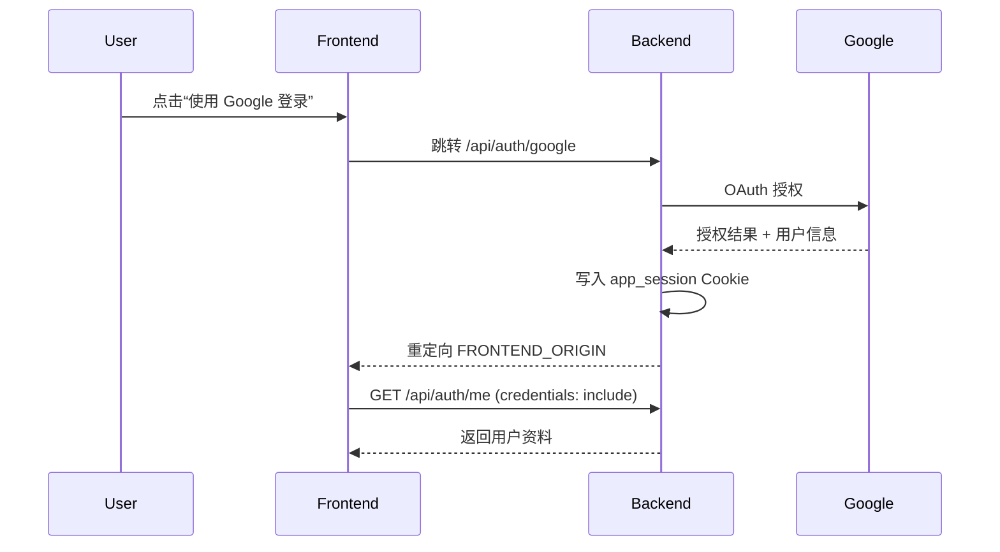

接口列表

---

## 1. Google OAuth 登录（后端托管）

前端不再提交 ID Token，而是直接跳转到后端的 OAuth 入口。所有会话由服务器设置的 HttpOnly Cookie 维护。

- **接口地址**：`GET /api/auth/google`
- **说明**：后端会重定向到 Google 授权页，成功后再重定向回 `FRONTEND_ORIGIN`，并写入 `app_session` Cookie。
- **前端调用示例**：

```ts
function redirectToLogin(redirectPath = '/travel-list') {
  window.location.href = `/api/auth/google?redirect=${encodeURIComponent(redirectPath)}`
}
```

> `redirect` 参数可选，后端应在授权成功后将用户带回指定路径。

---

## 2. 获取当前用户信息

**接口地址**：`GET /api/auth/me`

**请求**：
- 需携带 `credentials: include`（浏览器自动带上 `app_session` Cookie）

**响应**：
```json
{
  "id": "550e8400-e29b-41d4-a716-446655440000",
  "email": "user@example.com",
  "nickname": "John Doe",
  "avatarUrl": "https://lh3.googleusercontent.com/...",
  "preferredLanguage": "zh-CN",
  "createdAt": "2024-01-01T00:00:00.000Z",
  "updatedAt": "2024-01-01T00:00:00.000Z"
}
```

**前端示例**：
```ts
async function getCurrentUser(): Promise<UserProfile> {
  const response = await fetch('/api/auth/me', {
    credentials: 'include',
  })

  if (response.status === 401) {
    throw new Error('未登录')
  }

  if (!response.ok) {
    throw new Error(`获取用户信息失败: ${response.status}`)
  }

  return response.json()
}
```

---

## 3. 退出登录

**接口地址**：`POST /api/auth/logout`

**请求**：
- Method: `POST`
- Headers: `Content-Type: application/json`
- Options: `credentials: 'include'`

**前端示例**：
```ts
async function logout() {
  await fetch('/api/auth/logout', {
    method: 'POST',
    credentials: 'include',
  })
}
```

---

## 4. 在前端保护业务接口

- 所有需要认证的接口都要以 `credentials: 'include'` 方式调用，让浏览器自动附带 HttpOnly Cookie。

```ts
async function authenticatedFetch(url: string, options: RequestInit = {}) {
  return fetch(url, {
    ...options,
    headers: {
      'Content-Type': 'application/json',
      ...(options.headers || {}),
    },
    credentials: 'include',
  })
}
```

- Axios 示例：

```ts
const api = axios.create({
  baseURL: '/api',
  withCredentials: true,
})

api.interceptors.response.use(
  (res) => res,
  (error) => {
    if (error.response?.status === 401) {
      // 清理本地缓存、跳转登录页等
    }
    return Promise.reject(error)
  }
)
```

---

## 5. 后端保护路由

后端仍需校验 `app_session` Cookie 中的会话，示例（NestJS）：

```ts
@Controller('api/v1/journeys')
export class JourneyController {
  @Get()
  @UseGuards(SessionAuthGuard) // 自定义 Guard，基于 Cookie 验证
  async listJourneys(@CurrentUser() user: { userId: string }) {
    return this.journeyService.listJourneys(user.userId)
  }
}
```

---

## 6. 错误码说明

| 状态码 | 说明 |
|--------|------|
| 200    | 请求成功 |
| 401    | 未登录或会话过期 |
| 400    | 请求参数错误 |
| 500    | 服务器内部错误 |

**推荐的前端处理**：

```ts
async function handleApiError(response: Response) {
  if (response.status === 401) {
    // 清理本地状态、提示重新登录
    throw new Error('未登录或会话已过期')
  }
  const text = await response.text()
  throw new Error(`服务器错误: ${response.status} ${text}`)
}
```

---

## 7. 登录流程总结



---

## 8. 安全注意事项

1. **Cookie 设置**：`Secure; HttpOnly; SameSite=None`（跨域场景）或 `SameSite=Lax`（同域）。
2. **CORS**：后端必须允许前端 Origin 并开启 `Access-Control-Allow-Credentials`.
3. **HTTPS**：生产必须使用 HTTPS，否则浏览器会拒绝 `SameSite=None` Cookie。
4. **CSRF**：由于使用 Cookie，会话敏感接口应搭配 CSRF Token 或双重 Cookie 校验。
5. **Session 失效**：合理设置过期时间，并在 `/auth/logout`、`/auth/me` 中处理过期清理。

---

## 9. 更新日志

- 2025-XX-XX：改为后端托管 OAuth，使用 HttpOnly Session。

